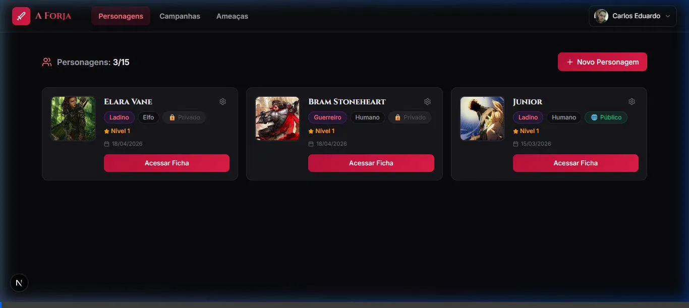

# 🛡️ A Forja - Ficha de Personagem D&D 5e

**A Forja** é uma plataforma web premium para jogadores e mestres de Dungeons & Dragons 5ª Edição. Desenvolvida com as tecnologias mais modernas do ecossistema React, oferece uma experiência de ficha digital fluida, visualmente deslumbrante e otimizada para dispositivos móveis.



---

## ✨ Funcionalidades Atuais

### 📊 Gestão de Personagem
- **Cálculos Automáticos**: Modificadores, proficiências, CA, iniciativa e bônus de ataque calculados em tempo real.
- **Regras 2024 (One D&D)**: Suporte total às novas regras, incluindo mudanças em espécies (raças) e classes.
- **Inventário Inteligente**: Catálogo de itens SRD com cálculo automático de peso e capacidade de carga.
- **Grimório Visual**: Biblioteca de magias completa com ícones personalizados para identificação rápida por escola de magia.

### 📜 Utilitários & Compêndios
- **Bestiário (Ameaças)**: Consulta rápida a monstros do SRD com blocos de estatísticas formatados.
- **Exportação PDF**: Geração de ficha oficial em PDF via `@react-pdf/renderer` para impressão ou compartilhamento.
- **Bloco de Notas**: Registro persistente de sessões e detalhes da campanha.

### 🔐 Segurança & Sincronização
- **Autenticação Multi-provedor**: Login seguro via Google e e-mail/senha através do NextAuth.
- **Persistência em Nuvem**: Seus personagens salvos e sincronizados via Supabase/PostgreSQL.

---

## 🚀 Roadmap de Desenvolvimento (Próximas Features)

Com base na análise do projeto, as seguintes funcionalidades estão planejadas:

1.  **🎲 Sistema de Rolagem Integrado**: Lançamento de dados (d20, d6, etc) diretamente da ficha para ataques, danos e perícias.
2.  **⏳ Automação de Descansos**: Botões de Descanso Curto e Longo que resetam automaticamente PV, recursos de classe e espaços de magia.
3.  **🏰 Gestão de Campanhas**: Dashboard para Mestres visualizarem as fichas de seus jogadores e gerenciarem o progresso do grupo.
4.  **📈 Assistente de Level Up**: Guia passo a passo para subida de nível, sugerindo incrementos de HP e novas habilidades.
5.  **🌍 Localização Internacional**: Suporte completo para Inglês (EN) além do Português (PT-BR).
6.  **🔌 Integração VTT**: Exportação de personagens em formato compatível com FoundryVTT e Roll20.

---

## 🛠️ Stack Tecnológica

- **Framework**: [Next.js 15+](https://nextjs.org/) (App Router + React 19)
- **Estilização**: Tailwind CSS 4 & Vanilla CSS
- **Banco de Dados**: PostgreSQL (via Supabase)
- **ORM**: Prisma
- **Autenticação**: NextAuth.js
- **PDF**: React-PDF Renderer

---

## ⚙️ Como Instalar e Rodar

1.  **Clone o repositório**:
    ```bash
    git clone https://github.com/seu-usuario/ficha-dnd.git
    ```

2.  **Instale as dependências**:
    ```bash
    npm install
    ```

3.  **Configure o banco de dados**:
    Crie um arquivo `.env` na raiz do projeto com as seguintes variáveis:
    ```env
    DATABASE_URL="sua_url_do_postgres"
    DIRECT_URL="sua_url_direta_do_postgres"
    NEXTAUTH_SECRET="seu_secret_aqui"
    GOOGLE_CLIENT_ID="seu_id_do_google"
    GOOGLE_CLIENT_SECRET="seu_secret_do_google"
    ```

4.  **Sincronize o Banco**:
    ```bash
    npx prisma db push
    ```

5.  **Inicie o servidor de desenvolvimento**:
    ```bash
    npm run dev
    ```

---

## ⚖️ Licença

Este projeto utiliza o conteúdo do **System Reference Document 5.1/5.2** da Wizards of the Coast, sob a licença Creative Commons Attribution 4.0 International.
